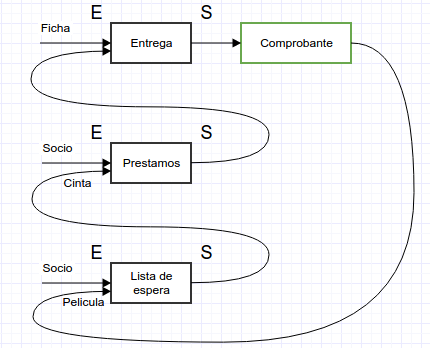
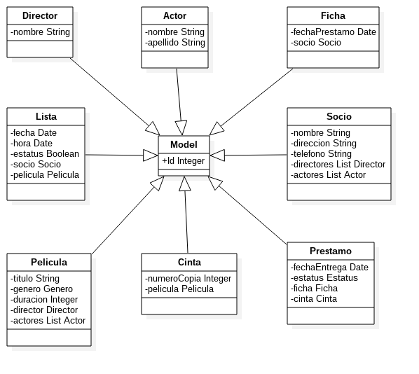
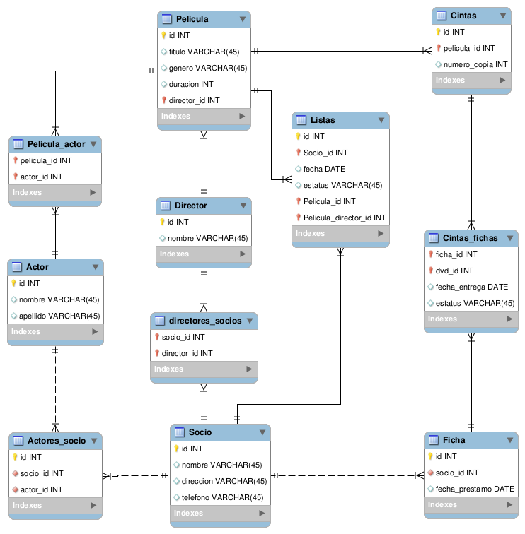

# VideoClub

# Diagrama de procesos

# Diagrama de clases

Para el proyecto fueron tomadas en cuenta 8 clases y 1 más la cual es una generalización que sirve como modelo y además contiene atributos comunes de las demás como el id y las palabras reservadas para consultas sql. Cada una de las clases tiene una homóloga en el esquema E-R.

# Diagrama entidad - relacion

Se definieron 8 tablas principales, más 3 que sirven para sustentar relaciones m : n las cuales se distinguen por no tener un campo id propio como columna.
